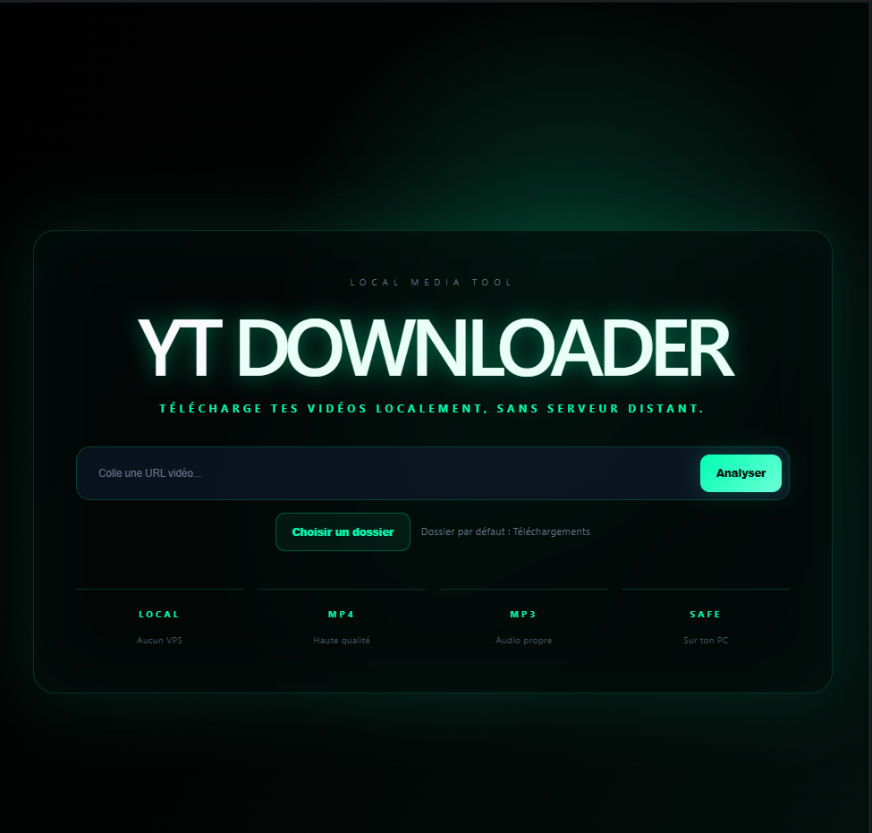

# YT Downloader Desktop

A modern Windows desktop application for downloading online videos and audio locally.



## Features

- Video preview before download
- MP4 download
- MP3 extraction
- Custom download folder
- Download progress bar
- Local processing
- Bundled yt-dlp
- Bundled ffmpeg
- No remote server required

## Screenshots

YT Downloader Desktop provides a clean and modern interface inspired by premium desktop applications.

## Download

Latest release:

https://github.com/zayvenlabs/yt-downloader-desktop/releases/latest

## Tech Stack

- React
- TypeScript
- Electron
- yt-dlp
- FFmpeg
- Electron Builder

## Development

Install dependencies:

```bash
npm install
```

Start Vite:

```bash
npm run dev
```

Start Electron:

```bash
npm run electron
```

Build Windows executable:

```bash
npm run dist:win
```

## Project Structure

```txt
electron/
├── main.cjs
├── preload.cjs

src/
├── App.tsx
├── App.css
├── index.css

binaries/
├── yt-dlp.exe
├── ffmpeg.exe
├── ffprobe.exe
```

## Disclaimer

This software is provided for open source based on [Yt-dtlp.](https://github.com/yt-dlp)

Users are responsible for ensuring they have the necessary rights and permissions to download or process content.

## License

MIT License

---

Developed by Zayven Labs